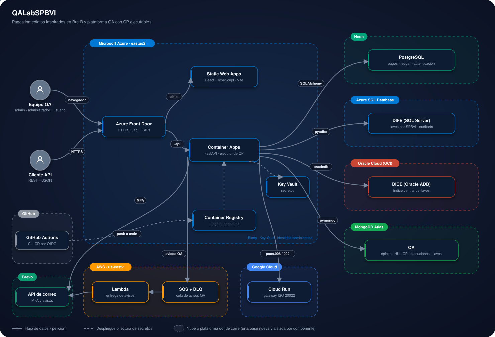

# QALabSPBVI

<p>
  <a href="https://qalabspbvi.vercel.app"></a>
  <!-- Activar al registrar el proyecto en portafolio-status (slug qalabspbvi):
  <a href="https://frontend-nine-topaz-99.vercel.app"></a>
  <a href="https://d4i3vsgw7xwmh.cloudfront.net"></a>
  -->
</p>


Laboratorio simulado de pagos inmediatos interoperables, inspirado en Bre-B (Banco de la República de Colombia). Sirve para practicar y mostrar aseguramiento de calidad automatizado: pruebas de API REST con JSON, mensajería ISO 20022 de laboratorio y recorridos E2E.

Es un proyecto de portafolio: **no se conecta a ninguna infraestructura real de pagos** y la liquidación (MOL) es una simulación.

### En pocas palabras

- **Qué hace:** simula el ecosistema Bre-B. Registra llaves (celular, correo, documento, alfanumérica `@` y código de comercio) en el directorio de cada SPBVI (DIFE) y en el central (DICE). Procesa pagos entre cuentas del mismo SPBVI o de SPBVI distintos, con idempotencia, límite de 1.000 UVB y mensajes pacs.008 / pacs.002 de laboratorio.
- **Para el equipo QA:** una plataforma tipo Jira (épica → HU → CP, tareas, bugs y fixes). Cada CP es una solicitud REST con JSON que se ejecuta con un clic. El resultado muestra método, URL, solicitud, respuesta y veredicto. El sistema genera las llaves de prueba según su tipo, y las transacciones las toman de la lista de llaves de la épica.
- **Cómo probarlo:** entra a la [demo](https://qalabspbvi.vercel.app) con una cuenta creada por un administrador (acceso con contraseña y código por correo). La épica `EPIC-00001` ya trae el programa ISO 20022 cargado. Para correrlo en tu equipo, ve a [Instalación](#instalación) y [Puesta en marcha](#puesta-en-marcha).

## Demo en vivo

**Aplicación:** [qalabspbvi.vercel.app](https://qalabspbvi.vercel.app)

**Documentación de la API:** `/api/docs` en la demo o `http://127.0.0.1:8000/docs` en local.

No hay cuentas públicas ni contraseñas por defecto: el acceso lo da un administrador.

## Funcionalidades

**Llaves Bre-B (DIFE y DICE)**
- Catálogo de tipos de llave con validación y forma canónica (`GET /keys/types`).
- Registro con unicidad global: DICE reserva (`pending`), DIFE activa y DICE confirma. Nunca hay duplicados, ni con registros simultáneos.
- Ciclo de vida completo: asignación de titular, suspensión y reactivación (administrativa o personal) y eliminación con auditoría.
- Coordinación DIFE/DICE recuperable: si un paso falla, la misma solicitud se reintenta sin duplicar la auditoría.

**Cuentas y pagos**
- Pago intra-SPBVI: resuelve la llave solo en el DIFE (el DICE recibe cero consultas) y liquida en una transacción.
- Pago inter-SPBVI: resuelve en el DICE, liquida con el MOL simulado y devuelve `pacs008_xml` y `pacs002_xml`.
- Idempotencia por `operation_id`, límite de 1.000 UVB por operación y rechazos sin efectos sobre los saldos.
- Consulta de estado (equivalente a pacs.028) y extracto conciliado (equivalente a camt.052/053).

**Plataforma QA**
- Épicas, HU, CP, tareas, bugs y fixes con permisos por rol validados en el servidor.
- CP ejecutables (API REST + JSON) con editor del JSON y versionado: cada cambio guarda la versión anterior en el historial.
- Llaves generadas automáticamente según el tipo Bre-B y lista de llaves por épica, que las transacciones eligen según el tipo que indica el CP.
- Importación de programas completos (HU, CP y tareas) y plantillas para crear la documentación.
- Programa ISO 20022 Bre-B adaptado: 19 HU, 35 CP ejecutables y 22 tareas.
- Avisos por correo a la épica con plantilla HTML propia y texto plano.

**Acceso**
- Contraseña (Argon2id) y código MFA por correo, con reenvío sin volver a pedir la contraseña.
- Roles `admin`, `administrador` y `usuario`; sesiones con vencimiento por inactividad y absoluto, y protección CSRF.

## Stack

| Capa | Tecnología |
|---|---|
| Backend | Python 3.13, FastAPI, SQLAlchemy 2 (monolito modular por dominios) |
| Frontend | React, TypeScript, Vite; tema claro y oscuro |
| Pagos y autenticación | PostgreSQL (Neon) |
| DIFE | SQL Server (Azure SQL Database) con pyodbc y ODBC Driver 18 |
| DICE | Oracle Autonomous Database (OCI) con python-oracledb |
| QA | MongoDB (Atlas) con pymongo |
| ISO 20022 | lxml con XSD propios de laboratorio; gateway propio en Render |
| Avisos | AWS SQS (con DLQ) y AWS Lambda que entrega por Brevo |
| Pruebas | pytest con mongomock y SQLite en memoria; Playwright para E2E |
| Infraestructura | Bicep (Azure) y CloudFormation (AWS) |
| CI/CD | GitHub Actions con OIDC hacia Azure y AWS; imágenes en GitHub Container Registry; Vercel con integración de Git |

## Conexiones externas

| Servicio | Uso | Obligatorio |
|---|---|---|
| PostgreSQL | Pagos, ledger, usuarios y sesiones | Sí (en local se puede usar SQLite temporal) |
| SQL Server | DIFE: llaves por SPBVI y auditoría | Sí |
| Oracle | DICE: índice central de llaves | Sí |
| MongoDB | Artefactos QA: épicas, HU, CP, ejecuciones y llaves | Sí |
| Brevo (API HTTP) | Código MFA, bienvenida y avisos QA | Sí para iniciar sesión (el MFA llega por correo) |
| AWS SQS + Lambda | Cola y entrega de los avisos QA | No: sin `NOTIFICATIONS_QUEUE_URL` los avisos salen directo por Brevo |
| Gateway ISO 20022 (Render) | Genera los pacs.008 / pacs.002 | No: sin `ISO_GATEWAY_URL` o si no responde, se generan en proceso |

Cada componente usa una base **nueva, vacía y dedicada**. Ninguna se comparte ni reutiliza datos de otros proyectos.

## Arquitectura

<p align="center">
  
</p>

- **Vercel** publica el frontend React y reenvía `/api/*` a la API en **Azure Container Apps** (sin el prefijo). Para el navegador todo es el mismo dominio, así que las cookies siguen siendo `SameSite=Strict`.
- La **API FastAPI** está organizada por dominios: autenticación, llaves (DIFE/DICE), pagos con MOL simulado, adaptador ISO 20022 y gestión QA con su ejecutor de CP.
- Cada dominio persiste en su propia nube: pagos y autenticación en **Neon**, DIFE en **Azure SQL**, DICE en **Oracle ADB (OCI)** y QA en **MongoDB Atlas**.
- Los avisos QA van a una cola **AWS SQS** y una **Lambda** los entrega por Brevo. Los mensajes que fallan cinco veces pasan a una cola de fallidos (DLQ). La API solo puede enviar a la cola.
- El código MFA no usa la cola: sale directo por Brevo, para no sumarle demora al inicio de sesión.
- Los mensajes pacs.008 / pacs.002 los genera un **gateway ISO 20022 en Render**, un servicio sin estado. La API vuelve a validar el XML que recibe. Si el gateway no responde, lo genera en proceso, así un pago ya liquidado siempre tiene su mensaje. La respuesta indica quién lo generó en `iso_gateway`.
- El núcleo del dominio no depende del formato de mensaje: el adaptador ISO 20022 recibe datos neutrales del pago. Todos los montos son enteros en centavos.
- Los secretos viven en **Key Vault** y la API los lee con identidad administrada. Las bases solo aceptan la IP de salida de la Container App y la de administración.

## Estructura

```
app/
├── api/              Rutas HTTP y esquemas
├── core/             Configuración, seguridad, correo y plantilla de correos
├── db/               Modelos SQLAlchemy y sesiones
├── domains/
│   ├── auth/         Credenciales, MFA, reenvío y sesiones
│   ├── keys/         Catálogo de tipos, DIFE/DICE y ciclo de vida
│   ├── payments/     Pagos intra/inter-SPBVI, límite por operación, MOL y ledger
│   ├── iso20022/     Adaptador XML de laboratorio y XSD propios
│   └── qa/           Gestión tipo Jira, ejecutor HTTP, marcadores, importación y avisos
├── cli.py            Comandos de operación (admin inicial, tablas de llaves, seed-program)
└── main.py           Punto de entrada FastAPI
services/
├── notifier/         Lambda de AWS que entrega los avisos QA por Brevo
└── iso20022_gateway/ Gateway ISO 20022 para Render (FastAPI + Dockerfile)
qa_programs/
├── build_iso20022_breb.py        Generador del programa ISO 20022
├── iso20022-breb-rest-json.json  Programa importable
└── plantillas/                   Plantillas de épica, programa, HU, CP, tarea, bug y fix
tests/                Pruebas del backend y servidor aislado para E2E
web/                  Interfaz React/TypeScript y pruebas Playwright (web/e2e)
infra/azure/          Bicep del laboratorio
infra/aws/            CloudFormation de la cola, la DLQ, la Lambda y sus permisos
docs/                 Diagrama e insignias del README
```

## Requisitos

- Python 3.11 o superior y Node.js 20 o superior.
- Bases nuevas y dedicadas: PostgreSQL, SQL Server con ODBC Driver 18, Oracle (por ejemplo Oracle Free con `FREEPDB1`) y MongoDB.
- Una cuenta de Brevo con remitente verificado, para enviar el código MFA y los avisos.

## Instalación

```powershell
git clone https://github.com/lariasca1994/QALabSPBVI.git
cd QALabSPBVI
python -m venv .venv
.\.venv\Scripts\Activate.ps1
python -m pip install -e ".[dev,postgres]"
Copy-Item .env.example .env
cd web; npm install; cd ..
```

Completa `.env`. Los nombres deben coincidir exactamente: la configuración ignora las variables desconocidas, así que un nombre distinto deja la conexión en su valor por defecto sin avisar.

| Variable | Uso |
|---|---|
| `DATABASE_URL` | PostgreSQL de pagos y autenticación (`postgresql+psycopg://…`) |
| `DIFE_DATABASE_URL` | SQL Server del DIFE (`mssql+pyodbc://…?driver=ODBC+Driver+18+for+SQL+Server`) |
| `DICE_DATABASE_URL` | Oracle del DICE (`oracle+oracledb://…`) |
| `MONGODB_URL`, `MONGODB_DATABASE` | MongoDB de QA |
| `QA_TARGET_BASE_URL` | Destino del ejecutor de CP (en local, `http://127.0.0.1:8000`) |
| `AUTH_SECRET_KEY` | Clave de al menos 32 caracteres: `python -c "import secrets; print(secrets.token_urlsafe(48))"` |
| `BREVO_API_KEY`, `BREVO_SENDER_EMAIL`, `BREVO_SENDER_NAME` | Envío de correos por la API de Brevo |
| `PAYMENT_LIMIT_UVB`, `UVB_VALUE_CENTS` | Límite por operación (1.000 UVB) y valor de la UVB en centavos (supuesto; actualizar al vigente) |
| `QA_SECRET_…` | Secretos que un CP referencia como `{{secret:…}}`, sin guardarlos |
| `NOTIFICATIONS_QUEUE_URL`, `AWS_REGION` | Cola SQS de avisos (opcional); credenciales en `AWS_ACCESS_KEY_ID` y `AWS_SECRET_ACCESS_KEY` |
| `ISO_GATEWAY_URL`, `ISO_GATEWAY_TOKEN` | Gateway ISO 20022 en Render (opcional) |

Ningún secreto va al repositorio: solo `.env` (ignorado por git) o el gestor de secretos de la nube.

## Puesta en marcha

```powershell
python -m app.cli init-key-stores        # crea las tablas de DIFE y DICE (idempotente)
python -m app.cli create-initial-admin   # primer admin; solo funciona con la base vacía
python -m uvicorn app.main:app --reload
```

En otra terminal:

```powershell
cd web
npm run dev
```

La API queda en `http://127.0.0.1:8000` (salud en `/health`) y la interfaz en `http://127.0.0.1:5173`. Vite reenvía `/api` al backend. Las tablas de pagos y autenticación se crean al iniciar la API.

`docker compose up --build` levanta la API con un PostgreSQL local cuando Docker está disponible.

Para cargar un programa de pruebas en una épica nueva (o actualizar la existente):

```powershell
python -m app.cli seed-program qa_programs/iso20022-breb-rest-json.json CORREO_ADMIN CORREO_ADMINISTRADOR --actualizar
```

### Usuarios y roles

Los permisos se validan en el servidor; la interfaz solo oculta lo que el backend igual rechazaría.

| Acción | `admin` | `administrador` | `usuario` |
|---|---|---|---|
| Crear administradores | Sí | No | No |
| Crear usuarios | Sí | Sí | No |
| Crear épicas | Sí (único) | No | No |
| Asociar integrantes a épicas | Sí | Sí | No |
| Crear HU, CP e importar programas | No | Sí | No |
| Crear, asignar y reasignar tareas | Sí | Sí | No |
| Editar el JSON de un CP, ejecutarlo y avanzar tareas | Si integra la épica | Si integra la épica | Si integra la épica |
| Registrar bugs y fixes | No | No | Sí |
| Asignar responsables de bugs | Sí | Sí | No |
| Crear cuentas y registrar o administrar llaves | Sí | Sí | Solo acciones personales sobre sus llaves |

El primer `admin` se crea por CLI y los siguientes con `python -m app.cli create-admin`. El rol `admin` nunca se asigna por API. Cada cuenta nueva recibe un correo de bienvenida con su rol, nunca con la contraseña.

### Acceso y reenvío del código

1. `POST /auth/login` valida la contraseña y envía un código de seis dígitos. La respuesta es la misma exista o no la cuenta, y emite la cookie `HttpOnly` `qalab_pending_login` (15 minutos).
2. `POST /auth/resend-code` usa esa cookie para emitir un código nuevo sin volver a pedir la contraseña; el anterior queda invalidado. Hay 60 segundos entre envíos y un máximo de 3 códigos cada 15 minutos.
3. `POST /auth/verify-email-code` abre la sesión: vence a los 30 minutos sin actividad y a las 8 horas en total.

El código vence a los 5 minutos, admite 5 intentos y es de un solo uso. Toda operación que cambia estado exige el token CSRF (`GET /auth/csrf` y cabecera `X-CSRF-Token`).

### Llaves Bre-B

Tipos publicados por Banrep. Los formatos exactos no son públicos, así que estas reglas son **supuestos** del laboratorio:

| Código | Tipo | Ejemplo | Forma canónica |
|---|---|---|---|
| `document` | Documento de identidad | `1023456789` | 5 a 15 dígitos |
| `phone` | Celular | `3001234567` | 10 dígitos que inician en 3; se acepta `+57` |
| `email` | Correo electrónico | `nombre@dominio.com` | En minúsculas |
| `alias` | Llave alfanumérica | `@ana2026` | `@` + 3 a 20 letras o números |
| `merchant_code` | Código de comercio | `0012345` | 4 a 10 dígitos |

| Acción | Método y ruta |
|---|---|
| Crear | `POST /difes/{spbvi_id}/keys` |
| Resolver | `GET /difes/{spbvi_id}/keys/resolve?key_type=…&key_value=…` |
| Asignar titular | `PATCH /difes/{spbvi_id}/keys/owner` |
| Suspender / reactivar | `POST /difes/{spbvi_id}/keys/suspend` · `POST /difes/{spbvi_id}/keys/reactivate` |
| Eliminar | `DELETE /difes/{spbvi_id}/keys` (libera los índices y conserva la auditoría) |

### Cuentas y pagos

| Método y ruta | Descripción |
|---|---|
| `POST /accounts` | Crea una cuenta simulada con saldo inicial |
| `POST /payments` | Pago intra-SPBVI |
| `POST /payments/inter-spbvi` | Pago inter-SPBVI con pacs.008 / pacs.002 de laboratorio |
| `GET /payments/{operation_id}` | Estado del pago (`ACCP`, `PDNG`, `RJCT`) |
| `GET /accounts/{account_id}/statement` | Extracto con movimientos, totales y conciliación |

Reglas de los pagos:

- **Idempotencia:** el mismo `operation_id` con los mismos datos devuelve el pago original (`200`, `replayed: true`). Con datos distintos responde `409`.
- **Límite por operación:** el monto no puede superar `PAYMENT_LIMIT_UVB × UVB_VALUE_CENTS`. Si lo supera, la API responde `422`; en un pago inter, además, devuelve un pacs.002 `RJCT`.
- **Sin efectos parciales:** un rechazo o una falla a mitad del movimiento no deja débito ni crédito, y las entradas del ledger de cada pago suman cero.

Los perfiles `pacs.008.001.08` y `pacs.002.001.10` usan XSD propios limitados a los campos implementados. **No son los XSD oficiales ni prueban conformidad con ISO 20022 o Banrep.**

### Casos de prueba

Todo CP ejecutable es una solicitud REST con JSON:

```json
{
  "request_method": "POST",
  "request_path": "/payments",
  "request_query": {},
  "request_headers": {},
  "request_body": {
    "operation_id": "{{op:pago:new}}",
    "source_account_id": "qa-breb-a-origen",
    "destination_key_type": "phone",
    "destination_key_value": "{{key:phone:spbvi-a}}",
    "amount_cents": 125000
  },
  "expected_status_codes": [201],
  "expected_response": {"operation_id": "{{op:pago}}", "status": "completed"}
}
```

El CP aprueba si el código HTTP está entre los esperados y la respuesta contiene los campos de `expected_response`. Con `null`, solo se valida el código. Al ejecutarlo, el sistema reemplaza los marcadores:

| Marcador | Resultado |
|---|---|
| `{{key:new:TIPO}}` | Genera una llave nueva y válida del tipo Bre-B. Si el registro responde 2xx, entra en la lista de llaves de la épica |
| `{{key:TIPO:SPBVI}}` | Toma una llave de esa lista. Por defecto es la más reciente; al ejecutar se puede elegir otra del mismo tipo |
| `{{op:NOMBRE:new}}` / `{{op:NOMBRE}}` | Genera un identificador de operación o reutiliza el último (reenvíos y consultas de estado) |
| `{{secret:NOMBRE}}` | Valor de `QA_SECRET_NOMBRE`; nunca se guarda ni se muestra |

El JSON de cada CP se edita desde **Calidad y pruebas → JSON** o con `PUT /qa/cases/{case_key}`, y cada cambio deja la versión anterior en el historial.

El ejecutor solo admite rutas relativas al destino configurado y no sigue redirecciones. La sesión de quien ejecuta solo se reenvía al mismo host; por eso, en la nube, `QA_TARGET_BASE_URL` apunta al dominio de la Container App.

Bugs: `abierto → asignado → en_fix → listo_para_retest → cerrado`, o `reabierto` si falla el retest. Tareas: `abierta → en curso → hecha`.

### Programa ISO 20022 y plantillas

`qa_programs/iso20022-breb-rest-json.json` adapta el documento "Programa de Pruebas ISO 20022 – Ecosistema BREB BanRep (Enfoque API REST / JSON)" a los endpoints del laboratorio:

- La HU de preparación (`LAB-HU-000`) crea las cuentas y genera una llave de cada tipo.
- pain.001 → `POST /payments`
- pacs.008 / pacs.002 → `POST /payments/inter-spbvi`
- pacs.028 → `GET /payments/{id}`
- camt.052 / camt.053 → `GET /accounts/{id}/statement`

Las HU de mensajes que todavía no tienen endpoint (pacs.004, camt.056, camt.029, camt.054) se cargan sin CP y lo indican en su descripción. El programa se regenera con `python qa_programs/build_iso20022_breb.py`.

En [`qa_programs/plantillas/`](qa_programs/plantillas/README.md) hay plantillas para cada pieza. El `admin` usa la de épica. Las de programa, HU, CP, tarea, bug y fix sirven para el resto de la documentación.

## Pruebas

No requieren bases reales ni envían correos: usan SQLite en memoria, `mongomock` y un emisor de correo falso.

```powershell
python -m pytest                          # backend
cd web; npm run build; npm run test:e2e   # compilación y E2E con Playwright
```

- **Backend:** cubre las pruebas de aceptación de la fase 1 y el resto del sistema.
  - Fase 1: llaves duplicadas en paralelo, rechazos sin efectos, idempotencia, rollback, ledger que suma cero y cero consultas al DICE en pagos intra.
  - Llaves, pagos inter con ISO 20022, autenticación y MFA, roles y gestión QA.
  - Plantillas validadas contra los esquemas.
  - Programa ISO 20022 completo: 35 CP en dos rondas, con llaves nuevas en cada una.
- **E2E:** levantan una API aislada (puerto 8010) y Vite (5174). Recorren MFA, ejecución y edición de un CP, ciclo de llaves y pagos intra e inter, en anchos de 320 a 375 px.

## Correos

Todos los correos (código MFA, bienvenida y avisos QA) usan una sola plantilla (`app/core/email_templates.py`):

- **Formato:** HTML con CSS inline y una columna adaptable, más una alternativa en texto plano.
- **Sin recursos externos:** no usan JavaScript, imágenes, fuentes ni hojas de estilo externas.
- **Contenido:** nunca incluyen credenciales, tokens ni datos de pagos. La única excepción es el código MFA, que se muestra con su vencimiento y el aviso de no compartirlo.

Salen por la API HTTP de Brevo y el remitente (`BREVO_SENDER_EMAIL`) debe estar verificado:

- **Código MFA y bienvenida:** salen directo desde la API.
- **Avisos QA:** cuando `NOTIFICATIONS_QUEUE_URL` está configurada, la API los encola en AWS SQS y la Lambda `qalabspbvi-notifier` los entrega. La Lambda lee la API key de Brevo desde SSM Parameter Store.

Cada aviso indica quién hizo la acción; en las ejecuciones dice "Ejecutado por" con el nombre y el correo.

Los avisos QA llegan a todos los integrantes de la épica, incluido quien hizo la acción. Las importaciones y actualizaciones de programas envían un solo resumen.

Si Brevo falla, la acción queda guardada y el aviso se reintenta con `POST /qa/notifications/retry`.

## Despliegue

El laboratorio reparte sus componentes entre varias nubes, cada uno con su base dedicada, y **todo corre en capas gratuitas**:

| Componente | Proveedor | Plan |
|---|---|---|
| Frontend React y proxy `/api` | Vercel | Hobby (gratuito) |
| API FastAPI | Azure Container Apps (eastus2) | Concesión mensual gratuita, escala a cero |
| Imágenes de la API y del gateway | GitHub Container Registry | Gratuito para paquetes públicos |
| Pagos y autenticación | Neon PostgreSQL (us-east-2) | Free |
| DIFE | Azure SQL Database (australiaeast) | Oferta gratuita; se pausa si se agota el cupo mensual |
| DICE | OCI Autonomous Database (sa-bogota-1) | Always Free |
| QA | MongoDB Atlas (AWS us-east-1) | M0 gratuito |
| Avisos QA | AWS SQS con DLQ y AWS Lambda (us-east-1), en `infra/aws/notifications.yaml` | Capa gratuita permanente |
| Gateway ISO 20022 | Render | Free (se suspende sin uso; la API usa el adaptador local mientras despierta) |
| Correo | Brevo | 300 correos al día |
| Secretos | Azure Key Vault; SSM Parameter Store para la Lambda | Uso mínimo / gratuito |

**Las bases duermen sin uso y se activan al entrar:**

- La API escala a cero y no usa pool de conexiones en la nube (`DATABASE_POOL=null`): no quedan sesiones abiertas que mantengan despiertas a Azure SQL (pausa a los 60 minutos) o a Neon (suspensión a los 5 minutos).
- `/health` no toca ninguna base, así que los monitores no las despiertan.
- Al abrir la aplicación con sesión válida, `/auth/me` despierta DIFE y DICE en segundo plano. Mientras Azure SQL se reanuda (cerca de un minuto), la conexión se reintenta, y si aún no está lista la API responde `503` con "La base de datos se está activando".

La oferta gratuita de Azure SQL solo se pudo crear en australiaeast: eastus2 y eastus no admiten servidores nuevos, y en las demás regiones de América la creación falla. Por eso DIFE responde con algo más de latencia que el resto.

El despliegue es continuo:

1. Cada push a `main` ejecuta en GitHub Actions las pruebas del backend, la compilación de React y los E2E.
2. Si pasan, se construyen las imágenes de la API y del gateway ISO 20022, etiquetadas con el commit, y se publican en GHCR.
   - El build falla si al driver ODBC le falta alguna librería.
   - Antes de seguir se comprueba que la imagen se descarga sin credenciales.
3. Se crea una revisión nueva de la Container App, se publica el código de la Lambda y se despliega el gateway en Render.
4. Vercel publica la interfaz por su integración con el repositorio.
5. Al final se comprueba que la API responde por la URL pública y que el sitio publicado es la compilación.

GitHub entra a Azure y AWS por OIDC con permisos mínimos, sin contraseñas guardadas en el repositorio. En AWS, el rol de GitHub solo puede actualizar el código de la Lambda.

La infraestructura está en `infra/azure/main.bicep` y `infra/aws/notifications.yaml` y se aprovisiona por CLI.

### Supuestos y pendientes

Supuestos, que se ajustan al recibir el anexo 6 de la Circular DSP-465:

- Tipos y orden de los mensajes ISO 20022.
- Formatos de llave.
- Valor de la UVB.
- Mapeo de pain.001, pacs.028 y camt.052/053 a los endpoints.

Pendientes:

- Endpoints de pacs.004, camt.056, camt.029, camt.054 y pain.002 independiente.
- Mock server de latencia y fallos de red.
- Validación con JSON Schema.
- Pantalla de bugs y fixes.
- Gateway ISO 20022 en Render: el código y la CD están listos, falta crear el servicio.
- Avisos por correo: el plan gratuito de Brevo (300 por día) se agotó en las pruebas. Los avisos rechazados quedan en la DLQ de SQS y se pueden reenviar cuando se renueve el cupo.
- Logs en Neon y entorno de producción.

## Autor

**Luis Felipe Arias Carriazo**
[GitHub](https://github.com/lariasca1994) · [LinkedIn](https://linkedin.com/in/lfac1)

## Licencia

MIT
